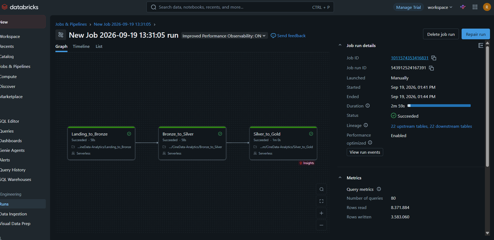

# CineData Analytics

## Etapas do projeto

### 1. Bronze

No notebook `Landing_to_Bronze.ipynb`, fiz a leitura dos cinco arquivos CSV da atividade e salvei os dados em tabelas Delta.

Também consultei a API do Banco Central para obter a cotação do dólar. Nessa etapa, mantive os dados próximos do formato original e adicionei a data e hora de ingestão.

### 2. Silver

No notebook `Bronze_to_Silver.ipynb`, fiz o tratamento dos dados da Bronze.

Corrigi formatos de datas, converti valores financeiros e métricas para os tipos corretos, tratei informações ausentes e registros repetidos e organizei os dados de avaliações, gêneros, pessoas e produtoras.

Também tratei as cotações do dólar, preenchendo os dias sem cotação com o último valor disponível. Depois, salvei os dados tratados em tabelas Delta na Silver.

### 3. Gold

No notebook `Silver_to_Gold.ipynb`, organizei os dados da Silver em tabelas fato, dimensões e tabelas-ponte para facilitar as análises.

Também desenvolvi as seis consultas solicitadas na atividade, envolvendo receita dos filmes, popularidade, gêneros, ranking de receita, participações de atores e lucro das produtoras.

Por último, criei uma tabela que reúne as informações dos filmes em formato de texto para servir como contexto para um assistente de IA.

## Workflow

Criei um Job no Databricks para executar os três notebooks na ordem correta:

`Landing_to_Bronze` → `Bronze_to_Silver` → `Silver_to_Gold`

Configurei as dependências entre as tarefas e um agendamento diário, que deixei pausado após os testes. Executei o Workflow e as três etapas terminaram com sucesso.

O arquivo `job.yaml` contém a configuração do Job.

### Print da execução

## Arquivos do repositório

- `Landing_to_Bronze.ipynb`: ingestão dos dados.
- `Bronze_to_Silver.ipynb`: limpeza e tratamento dos dados.
- `Silver_to_Gold.ipynb`: modelagem e análises.
- `job.yaml`: configuração do Workflow.
- `job_execucao_sucesso.png`: print da execução do Workflow.

**OBS:** O agendamento diário do Workflow foi pausado após a execução bem-sucedida dos testes para evitar novas execuções automáticas desnecessárias e o consumo de recursos do ambiente Databricks. O Job permanece configurado e pode ser executado manualmente. O arquivo `job.yaml` foi mantido no repositório para documentar sua configuração.

